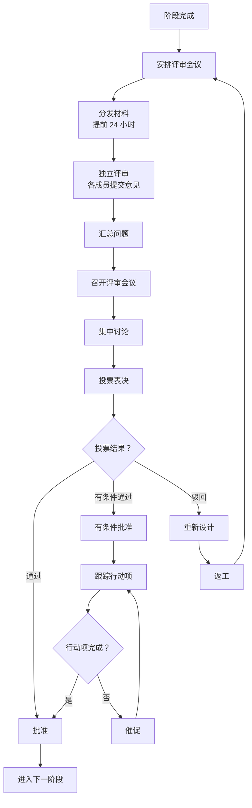

# Parlant Agent 配置挖掘系统 - 多 Agent 系统设计

**版本**: v3.0 (重构版)  
**创建日期**: 2026-03-13  
**关联文档**: [01_project_overview.md](01_project_overview.md)

---

## 一、系统架构总览

### 1.1 核心架构模式

本系统采用**人类团队模拟**的多 Agent 协作架构，核心理念:

1. **角色驱动**: 每个 Agent 对应人类咨询团队的特定角色
2. **评审团决策**: 关键决策通过 Review Board 集体讨论和投票
3. **分层协作**: Coordinator 统筹规划，各 Agent 专注执行
4. **持续反馈**: 四级质检机制确保输出质量

### 1.2 系统组件关系

```
┌─────────────────────────────────────────────────────┐
│              Coordinator Agent                      │
│         (项目经理 - 整体协调和进度控制)               │
└──────────────────┬──────────────────────────────────┘
                   │
        ┌──────────┼──────────┐
        ↓          ↓          ↓
   ┌────────┐ ┌────────┐ ┌────────┐
   │Requirement│ │Domain  │ │Data    │
   │Analyst  │ │Expert  │ │Analyst │
   └────┬────┘ └────┬────┘ └────┬────┘
        │          │          │
        └──────────┼──────────┘
                   │
            ┌──────┴──────┐
            │UserPortrait │
            │   Miner     │
            └──────┬──────┘
                   ↓
            ┌─────────────┐
            │  Knowledge  │
            │   Fusion    │
            └──────┬──────┘
                   ↓
        ┌──────────┼──────────┐
        ↓          ↓          ↓
   ┌────────┐ ┌────────┐ ┌────────┐
   │Process │ │Rule    │ │Tool    │
   │Designer│ │Engineer│ │Architect│
   └────┬────┘ └────┬────┘ └────┬────┘
        │          │          │
        └──────────┼──────────┘
                   ↓
            ┌─────────────┐
            │  Journey    │
            │  Builder    │
            └──────┬──────┘
                   ↓
            ┌─────────────┐
            │   Config    │
            │ Assembler   │
            └──────┬──────┘
                   ↓
            ┌─────────────┐
            │QAModerator  │
            │(评审团主席)  │
            └─────────────┘
```

---

## 二、标准工作流程 (6 个 Sprint)

### Sprint 0: 需求分析阶段 (1 周)

**目标**: 深入理解客户需求，形成结构化需求文档

**参与 Agent**:
- **Coordinator**: 主持需求分析会议
- **RequirementAnalyst**: 记录需求、提出澄清问题
- **DomainExpert**: 提供行业视角
- **CustomerAdvocate**: 代表用户发声

**关键活动**:
1. 需求收集会议
2. 澄清提问 (消除歧义)
3. 需求分解和结构化
4. 多方确认和评审

**产出**: 
- 需求文档 v2.0 (评审通过)
- 待澄清问题清单
- 项目范围说明书

### Sprint 1: 知识挖掘阶段 (1-2 周)

**目标**: 从公开资料和私域数据中挖掘行业知识

**参与 Agent**:
- **DomainExpert**: 负责公开知识挖掘 (Deep Research)
- **DataAnalyst**: 负责私域对话数据分析
- **UserPortraitMiner**: 负责用户特征提取和画像生成 (新增)

**关键优化**:
- **DomainExpert**: 采用"基于业务维度的智能拆分 + 并发搜索",提速 5-8x
- **DataAnalyst**: 采用"分治策略",单通对话独立处理 + 流程挖掘，提速 5-10x
- **UserPortraitMiner**: 采用"增量式用户特征聚合",实时统计群体特征

**产出**:
- 公开知识库 v1.0(术语、流程、最佳实践、合规要求)
- 私域知识库 v1.0(场景、流程、统计洞察)
- 融合知识库 v1.0(标注来源和置信度)
- **用户画像库 v1.0(用户分群、典型画像、专属指南映射)**

### Sprint 2: 流程设计阶段 (1 周)

**目标**: 基于需求和知识设计业务流程

**参与 Agent**:
- **ProcessDesigner**: 主导流程设计
- **CustomerAdvocate**: 同步评估用户体验
- **DomainExpert**: 提供专业建议

**关键活动**:
1. 设计主流程
2. 添加分支路径和异常处理
3. 绘制业务流程图
4. 体验优化

**产出**: 业务流程图 v1.0(评审通过)

### Sprint 3: 规则挖掘阶段 (1 周)

**目标**: 从流程和对话中提取规则

**参与 Agent**:
- **RuleEngineer**: 主导规则提取
- **CustomerAdvocate**: 测试规则合理性
- **DomainExpert**: 确认合规性

**关键活动**:
1. 挖掘 Observations(情绪/意图分类)
2. 挖掘 Guidelines(条件 - 动作对)
3. 提取 Canned Responses(话术)
4. 设计排除/依赖关系
5. 语义去重和冲突检测

**产出**: 规则集 v1.0(含关系设计，评审通过)

### Sprint 4: 工具与旅程构建 (1 周)

**目标**: 设计工具并构建 Journey 状态机

**参与 Agent**:
- **ToolArchitect**: 设计工具接口和实现
- **JourneyBuilder**: 构建 Journey 状态机
- **DataAnalyst**: 提供数据接口需求

**并行优化**: ToolArchitect 和 JourneyBuilder 完全解耦，最后才绑定，加速比 2.0x

**关键活动**:
1. 分析工具需求
2. 设计工具元数据和代码实现
3. 将流程映射为状态机
4. 绑定 Observations 和 Guidelines
5. 验证状态机 soundness

**产出**: Journey 配置 v1.0 + 工具代码 (评审通过)

### Sprint 5: 集成与质检 (1 周)

**目标**: 组装配置包并进行全面质检

**参与 Agent**:
- **ConfigAssembler**: 整合所有配置
- **QAModerator**: 组织最终评审
- **所有 Agent**: 参与评审

**关键活动**:
1. 整合所有中间产物
2. 格式校验 (JSON Schema)
3. 一致性检查 (引用完整性)
4. 运行测试用例
5. 生成质量报告

**产出**: Parlant 配置包 v1.0 + 质量报告

---

## 三、评审团 (Review Board) 机制

### 3.1 组织架构

**评审团主席**: QAModerator

**核心成员**:
- Coordinator
- DomainExpert
- CustomerAdvocate
- 相关领域 Agent(根据评审主题确定)

**法定人数**: 60% 以上成员出席

### 3.2 评审流程



### 3.3 投票规则

- **简单多数**: 超过 50% 赞成票
- **一票否决**: DomainExpert 和 CustomerAdvocate 拥有否决权
- **关键决策**: 需要 75% 以上赞成票

### 3.4 争议解决

对于分歧严重的问题:
1. 调用 LLM Council 进行仲裁
2. LLM 基于各方观点和证据给出倾向性建议
3. 评审团参考 LLM 建议重新投票

---

## 四、关键协作机制

### 4.1 知识融合机制

**公域 vs 私域融合策略**:

```
Step 1: DomainExpert 收集公域知识
  ↓
Step 2: DataAnalyst 处理私域对话 (增量式)
  ├─ 事件提取
  ├─ 场景识别
  ├─ 流程挖掘
  └─ **用户特征标注** (新增)
       ↓
Step 3: UserPortraitMiner 挖掘用户画像
  ├─ 特征提取
  ├─ 增量聚合
  ├─ 分群聚类
  └─ 画像生成
       ↓
Step 4: 实时对比融合
  
对比结果              处理方式
─────────────────────────────────
私域有，公域无   →   标注"企业特有实践",保留
公域有，私域无   →   标注"可能遗漏",需确认
两者冲突       →   标注"需人工审核",私域优先
  ↓
Step 5: 生成融合知识库 (标注来源和置信度) + 用户画像库
```

### 4.2 语义去重机制

**核心原理**: 使用 Embedding 技术进行语义级去重

**算法流程**:
1. **向量化**: 使用 Embedding 模型将每条规则转换为向量
2. **相似度计算**: 两两计算向量间的余弦相似度
3. **聚类分组**: 基于相似度阈值 (0.85) 进行聚类
4. **代表选择**: 每个簇中选择最佳代表

**应用场景**:
- 规则去重：避免冗余和冲突
- 旅程分支合并：识别相同状态序列
- 话术归一化：统一表达方式

### 4.3 冲突检测与处理

**Journey vs Guideline 冲突类型**:
1. **冲突**: 不同 Journey 绑定了互斥的 Guidelines
2. **重复**: 多个 Journey 包含语义相同但表达不同的 Guideline
3. **错误**: Guideline 的触发条件在当前 Journey 中永远无法满足
4. **遗漏**: Journey 的关键节点缺少必要的 Guideline 支持

**处理机制**:
1. **语义匹配**: 使用 Embedding 计算相似度，建立候选关联
2. **逻辑验证**: 基于业务规则验证关联的合理性
3. **冲突检测**: 识别循环依赖和优先级矛盾
4. **图优化**: 简化冗余边，优化关系结构

---

## 五、上下文管理与文件系统

### 5.1 标准文件结构

```
project_root/
├── task_plan.md          # 全局计划 (类似 Manus 的 todo.md)
├── progress.md           # 进度日志 (append-only)
├── findings.md           # 关键发现和决策
├── coordination_log.md   # Agent 间协调记录
└── agents/
    ├── coordinator/
    │   ├── decisions.md  # Coordinator 决策记录
    │   └── conflicts.md  # 冲突仲裁记录
    ├── requirement_analyst/
    │   ├── questions.md  # 澄清问题历史
    │   └── requirements_v1.md
    │   └── requirements_v2.md
    ├── domain_expert/
    │   └── public_knowledge_v1.md
    ├── data_analyst/
    │   ├── conversation_checkpoints/  # 对话处理检查点
    │   │   ├── checkpoint_batch_10.pkl
    │   │   └── checkpoint_batch_20.pkl
    │   └── private_knowledge_v1.md
    └── ...
```

### 5.2 文件更新规则

| 文件类型 | 创建时机 | 更新时机 | 内容压缩策略 |
|---------|---------|---------|-------------|
| `task_plan.md` | 项目启动 | 每个 Sprint 结束 | 保留完整历史 |
| `progress.md` | 每次 Agent 行动 | append-only | 永不清理 |
| `findings.md` | 任何重大发现 | 发现新信息时 | 保留关键引用 |
| `coordination_log.md` | Agent 交互 | 每次协调 | 结构化记录 |

### 5.3 上下文压缩策略

```python
# 上下文窗口 = RAM(易失、有限)
# 文件系统 = 磁盘 (持久、无限)

def compress_context_for_llm(filesystem_data):
    """将文件系统数据压缩为适合 LLM 上下文的格式"""
    compact_context = []
    
    # 保留最近的任务计划 (全文)
    compact_context.append(read_file("task_plan.md"))
    
    # 保留最近的 progress (最后 10 条)
    recent_progress = read_file("progress.md").split('\n')[-10:]
    compact_context.extend(recent_progress)
    
    # 旧数据只保留引用
    old_findings_refs = ["详见 findings.md#section_3", ...]
    compact_context.extend(old_findings_refs)
    
    return '\n'.join(compact_context)
```

---

## 六、性能优化总结

### 6.1 并行加速机会

| 环节 | 并行策略 | 理论加速比 |
|------|---------|-----------|
| **DomainExpert 搜索** | 4 个搜索分支独立并行 | 1.8x |
| **DomainExpert 内批量搜索** | 每分支内并发执行 | 2.5x |
| **DataAnalyst 对话处理** | 单通对话完全并行 | 5-10x |
| **ProcessDesigner vs CustomerAdvocate** | 同步评估用户体验 | 1.3x |
| **ToolArchitect vs JourneyBuilder** | 完全解耦并行 | 2.0x |
| **总体理论加速比** | - | **3.5-5x** |

### 6.2 关键优化策略

1. **分治策略**: 私域对话数据单通独立处理，最后聚合，提速 1.45x，内存占用降低 1000x
2. **基于业务维度的智能拆分**: Deep Research 提速 5-8x，覆盖面提升 30-50%
3. **文件系统管理**: 避免上下文超长，支持大规模协作
4. **防止任务偏离**: 每次决策前重申目标，减少错误和重复执行

---

**最后更新**: 2026-03-13  
**维护者**: System Team
