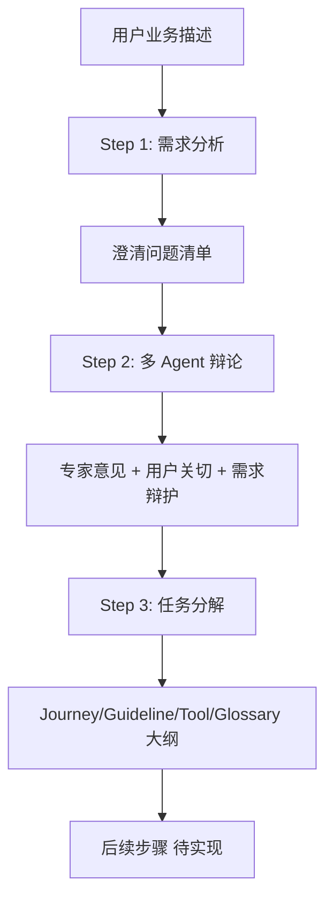

# Mining Agents v0.2.0 - 项目概览

**项目名称**: Mining Agents (Parlant Agent 配置挖掘系统)  
**当前版本**: v0.2.0-dev  
**开发状态**: 🚧 进行中  

## 项目简介

Mining Agents 是一个智能化的 Parlant Agent 配置挖掘系统，通过多 Agent 协作流程，从业务描述自动生成完整的 Agent 配置（包括 Journey、Guideline、Tool、Glossary）。

### 核心价值

- 🤖 **智能化**: 多 Agent 协作，模拟真实的需求分析团队
- 📊 **结构化**: 8 步流程化，每步都有清晰的输入输出
- 🔧 **可配置**: 灵活的配置文件，支持不同场景定制
- 📈 **可扩展**: 插件式 Agent 架构，易于添加新角色

## 核心特性

### ✅ 已实现功能 (v0.2.0)

#### Step 1: 需求分析
- **Agent**: RequirementAnalystAgent
- **功能**: 分析业务描述，生成澄清问题清单
- **输出**: `step1_clarification_questions.md`
- **模式**: 支持 Mock/Real 两种模式

#### Step 2: 多 Agent 辩论
- **参与 Agent**:
  - DomainExpertAgent (领域专家)
  - CustomerAdvocateAgent (客户倡导者)
  - RequirementAnalystAgent (需求分析师)
- **功能**: 三方辩论，从不同视角评估需求方案
- **输出**: 
  - `step2_expert_analysis.md` - 专家分析报告
  - `step2_customer_advocacy.md` - 客户倡导报告
  - `step2_debate_summary.md` - 辩论摘要

#### Step 3: 任务分解
- **Agent**: CoordinatorAgent
- **功能**: 整合各方意见，生成任务分解方案
- **输出**: `step3_task_breakdown.md`
- **组件**: Journey, Guideline, Tool, Glossary

### 🚧 规划中功能 (v0.3.0+)

#### Step 4: 全局规则设计
- **Agent**: RuleEngineerAgent
- **功能**: 设计全局规则和约束条件

#### Step 5: 专项 Agent 配置
- **Agent**: DomainExpertAgent (深化)
- **功能**: 针对特定领域的深度配置

#### Step 6: 私域数据抽取
- **Agent**: UserPortraitMinerAgent
- **功能**: 从私域对话数据中抽取用户画像

#### Step 7: 质量检查
- **Agent**: QAModeratorAgent
- **功能**: 全面质量检查和一致性验证

#### Step 8: 配置生成
- **Agent**: ConfigAssemblerAgent
- **功能**: 组装最终的 Parlant Agent 配置

## 技术架构

### 核心组件

```
src/mining_agents/
├── agents/                     # Agent 实现
│   ├── requirement_analyst_agent.py
│   ├── domain_expert_agent.py
│   ├── customer_advocate_agent.py
│   └── coordinator_agent.py
│
├── managers/                   # 管理器
│   ├── step_manager.py        # 步骤调度器
│   └── agent_orchestrator.py  # Agent 编排器
│
├── tools/                      # 工具服务
│   ├── deep_research.py       # 深度研究工具
│   ├── json_validator.py      # JSON 验证工具
│   ├── agentscope_tools.py    # AgentScope 工具集
│   └── file_service.py        # 文件服务
│
└── utils/                      # 工具函数
    ├── logger.py              # 日志工具
    └── file_utils.py          # 文件操作
```

### 执行流程



### 关键设计

#### 1. 步骤调度器 (StepManager)
- 支持断点续跑
- 状态追踪 (`status.json`)
- 处理器注册机制

#### 2. Agent 编排器 (AgentOrchestrator)
- 动态 Agent 加载 (importlib)
- 工具管理和注册
- 并行执行支持

#### 3. Mock/Real模式切换
- Mock 模式：无需 API Key，快速测试
- Real 模式：真实 LLM 调用，生产使用

## 快速开始

### 安装依赖

```bash
pip install agentscope pyyaml json-repair pytest
```

### 环境变量 (可选)

```bash
# Mock 模式不需要配置
# Real 模式需要以下环境变量：
export DASHSCOPE_API_KEY="your_dashscope_key"
export TAVILY_API_KEY="your_tavily_key"
```

### 基本用法

```bash
# 完整流程 (Step 1 → Step 3)
python -m mining_agents.main \
    --business-desc "电商客服 Agent" \
    --config prj/v0.1.0_mvp/config/system_config.yaml \
    --start-step 1 \
    --end-step 3 \
    --mock-mode

# 单步执行
python -m mining_agents.main \
    --business-desc "电商客服 Agent" \
    --start-step 2 \
    --end-step 2
```

### Windows 用户

```cmd
REM 使用启动脚本
prj\v0.1.0_mvp\run_step1.bat "你的业务描述"
```

## 配置说明

### 系统配置 (system_config.yaml)

```yaml
# 并发控制
max_parallel_agents: 4

# 步骤控制
start_step: 1
end_step: 3

# 输出配置
output_base_dir: "./output"

# 日志配置
logging:
  level: INFO
  file: logs/mining_agents.log
```

### 版本管理

不同版本的配置放在 `prj/` 目录下：

```
prj/
└── v0.1.0_mvp/
    ├── config/
    │   ├── system_config.yaml
    │   └── agents/
    │       ├── base_agent.yaml
    │       └── requirement_analyst.yaml
    ├── run_step1.bat
    ├── run_step1.sh
    ├── README.md
    └── CHANGELOG_v0.2.md
```

## 输出示例

### Step 1 输出

```markdown
# Step 1: 需求澄清问题清单

## 🔴 Q1: 您的客服 Agent 主要服务于哪些客户群体？

**类别**: `target_audience`

**为什么问这个问题**: 明确目标用户群体有助于设计合适的对话流程...

**您的回答**:
（请填写您的回答）
```

### Step 2 输出

```markdown
# Step 2: 多 Agent 辩论摘要

**辩论参与方**:
- 🎓 领域专家：关注技术可行性
- 👥 客户倡导者：关注用户体验
- 📋 需求分析师：关注需求完整性

## 🎓 领域专家核心观点
✅ **遵循行业标准的对话流程设计**
> 建议在对话流程设计中严格遵循行业标准...
```

### Step 3 输出

```markdown
# Step 3: 任务分解方案

## 🧩 核心组件

### 🔴 COMP1: Journey (用户旅程)
**描述**: 定义用户与 Agent 交互的完整流程

**子组件**:
- 意图识别流程
- 多轮对话管理
- 异常处理流程
```

## 测试

### 运行测试套件

```bash
# 所有测试
pytest tests/test_mvp.py -v

# Step 2 & Step 3 测试
pytest tests/test_step2_step3_agents.py -v

# 单个测试
pytest tests/test_step2_step3_agents.py::TestDomainExpertAgent -v
```

### 测试覆盖率

```bash
pytest --cov=mining_agents tests/
```

## 项目结构

```
mining_agents/
├── src/mining_agents/         # 源代码
│   ├── __init__.py
│   ├── cli.py                 # 命令行接口
│   ├── main.py                # 主入口
│   ├── agents/                # Agent 实现
│   ├── managers/              # 管理器
│   ├── tools/                 # 工具服务
│   └── utils/                 # 工具函数
│
├── prj/                       # 版本化配置
│   └── v0.1.0_mvp/
│       ├── config/
│       ├── scripts/
│       ├── run_*.bat/sh
│       └── *.md
│
├── tests/                     # 测试套件
│   ├── test_mvp.py
│   └── test_step2_step3_agents.py
│
├── docs/                      # 文档
│   └── plans/
│
├── output/                    # 输出目录 (运行时生成)
├── logs/                      # 日志目录 (运行时生成)
│
├── MVP_USAGE_GUIDE.md         # MVP 使用指南
├── AGENTSCOPE_TOOLS_GUIDE.md  # AgentScope 工具指南
└── requirements.txt           # 依赖列表
```

## 开发计划

### v0.3.0 (下一步)
- [ ] Step 4: 全局规则设计
- [ ] Step 5: 专项 Agent 配置
- [ ] 增强的 LLM 集成

### v0.4.0
- [ ] Step 6: 私域数据抽取
- [ ] Step 7: 质量检查
- [ ] Step 8: 配置生成

### v1.0.0 (目标)
- [ ] 完整的 8 步流程
- [ ] 完善的测试覆盖
- [ ] 生产环境部署支持
- [ ] 性能优化和监控

## 贡献指南

### 添加新的 Agent

1. 在 `src/mining_agents/agents/` 创建新文件
2. 实现标准接口：
   ```python
   class MyAgent:
       def __init__(self, name, orchestrator, **kwargs):
           ...
       
       async def execute(self, task, context):
           ...
   ```
3. 在 `agents/__init__.py` 中导出
4. 在 CLI 中注册 Step 处理器

### 代码规范

- 遵循 PEP 8
- 使用类型注解
- 编写单元测试
- 添加文档字符串

## 常见问题

**Q: Mock 模式和 Real 模式有什么区别？**  
A: Mock 模式使用硬编码数据，适合测试；Real 模式调用真实 LLM API，适合生产。

**Q: 如何断点续跑？**  
A: 使用 `--start-step` 参数指定起始步骤，系统会自动跳过已完成的步骤。

**Q: 输出文件在哪里？**  
A: 默认在 `./output/` 目录下，按步骤分子目录。

**Q: 如何修改配置？**  
A: 编辑 `prj/v0.1.0_mvp/config/system_config.yaml`。

## 相关资源

- [AgentScope 官方文档](https://agentscope.io/)
- [MVP 使用指南](MVP_USAGE_GUIDE.md)
- [Step 2 & Step 3 指南](prj/v0.1.0_mvp/STEP2_STEP3_GUIDE.md)
- [快速开始](prj/v0.1.0_mvp/QUICKSTART.md)

## 许可证

MIT License

## 联系方式

- 项目地址：[GitHub Repo]
- 问题反馈：[Issue Tracker]

---

**最后更新**: 2026-03-20  
**维护者**: Mining Agents Team  
**版本**: v0.2.0-dev
