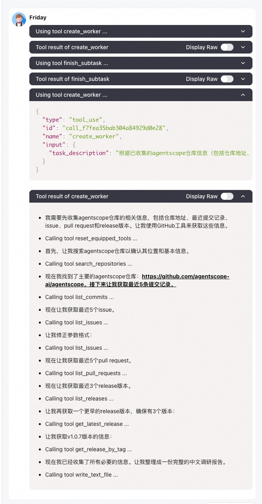
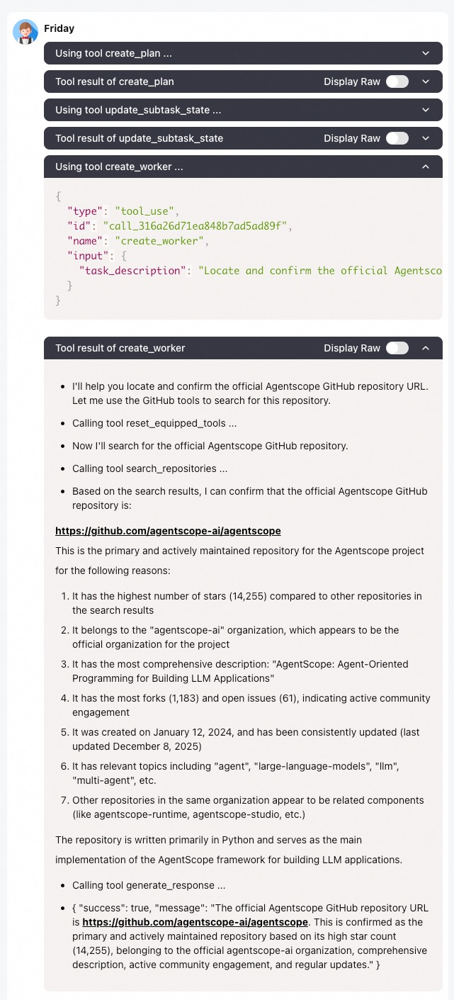

# Meta Planner Agent Example

In this example, we demonstrate

- how to build a planner agent that can decompose complex task into manageable subtasks and orchestrates sub-agents to
 complete them
- how to handle the printing messages of the sub-agents properly in a multi-agent system
- how to propagate interrupt events from sub agents to the main planner agent

Specifically, in [main.py](./main.py), a planner agent is created with the `PlanNotebook` instance to create and manage
plans. It's equipped with a tool function named `create_worker` in [tool.py](./tool.py) to create sub-agents
dynamically and finish the assigned subtask. The sub-agents are equipped with some basic tools, and some preset
MCP servers to enhance their capabilities.

> We suggest to use AgentScope-Studio to visualize the agent-interactions in this example.

## Quick Start

Install agentscope if you haven't already:

```bash
pip install agentscope
```

Make sure you have set your DashScope API key as an environment variable.

In this example, the sub-agents are equipped with the following MCP servers, set the corresponding environment variables to activate them.
If not set, the corresponding MCP will be disabled.
For more details about the tools, refer to [tool.py](./tool.py). You can also add or modify the tools as needed.

| MCP                      | Description                    | Environment Variable |
|--------------------------|--------------------------------|----------------------|
| AMAP MCP                 | Provide map related services   | GAODE_API_KEY        |
| GitHub MCP               | Search and access GitHub repos | GITHUB_TOKEN         |
| Microsoft Playwright MCP | Web Browser-use MCP server     | -                    |

Run the example:

```bash
python main.py
```

Then you can ask the planner agent to help you complete a complex task, such as "Conduct research on AgentScope repo".

Note for simple questions, the planner agent may directly answer without creating sub-agents.

## Advanced Usage

### Handling Sub-agent Output

In this example, the sub-agents won't print messages to the console directly (by `agent.set_console_output_enable(True)` in tool.py).
Instead, its printing messages are streamlined back to the planner agent as the streaming responses of the tool function `create_worker`.
By this way, we only expose the planner agent to the user, rather than multiple agents, which provides a better user experience.
However, the response of the tool function `create_worker` maybe take too much context length if the sub-agent finishes the given task with a long reasoning-acting process.

This figure shows how the sub-agent output is displayed as tool streaming response in AgentScope-Studio:

<details>
 <summary>Chinese</summary>
 <p align="center">
  
 </p>
</details>

<details>
 <summary>English</summary>
 <p align="center">
  
 </p>
</details>


Also, you can choose to expose the sub-agent to the user, and only take the structured results back to the planner agent as the tool result of `create_worker`.

### Propagating Interrupt Events

In `ReActAgent`, when the final answer is generated from the `handle_interrupt` function, the metadata field of the return message
will contain a `_is_interrupted` key with value `True` to indicate that the agent is interrupted.

By this field, we can propagate the interrupt event from the sub-agent to the main planner agent in the tool function `create_worker`.
For user defined agent classes, you can define your own propagation logic in the `handle_interrupt` function of your agent class.

### Changing the LLM

The example is built with DashScope chat model. If you want to change the model in this example, don't forget
to change the formatter at the same time! The corresponding relationship between built-in models and formatters are
list in [our tutorial](https://doc.agentscope.io/tutorial/task_prompt.html#id1)

## Further Reading

- [Plan](https://doc.agentscope.io/tutorial/task_plan.html)
