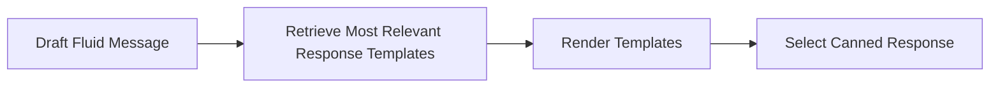

# Canned Responses

Canned responses provide you with precise control over your Parlant agent's responses.

The [concept of canned responses](https://en.wikipedia.org/wiki/Canned_response) comes from real-world contact centers, where they're widely used to ensure that agents communicate with customers in a consistent, accurate, and brand-aligned manner.

By restricting to a pre-defined and pre-approved set of responses, you ensure your agent communicates with a consistent tone, style, and accuracy, aligning perfectly with your brand voice and service protocols while **completely eliminating the risk of even subtle unwanted or hallucinated outputs**.

Canned responses function like a hand of cards: given a set of choices you provide to your agent, it selects the most appropriate "card" that best matches the required response based on the conversation context.


## A Practical Example

#### Without Canned Responses
Using LLM-generated (token-by-token) responses.

> **Customer:** Do you have it in stock?
>
> **Agent:** Yes, we've got this item in stock! Let me know if you need any help finding it.

#### With Canned Responses
```
# Draft message: "Yes, we've got this item in stock! Let me know if you need any help finding it."
#
# Available templates:
# - ...
# - "Hey, {{std.customer.name}}! What help do you need today?"
# - ...
# - "No, sorry, we've just sold the last ones. Would you like to see something similar?"
# - "Yep, we have it. Should I add it to your cart?"
# - ...
```
> **Customer:** Do you have it in stock?
>
> **Agent:** Yep, we have it. Should I add it to your cart?


## How Canned Responses Work

Under the hood, canned responses work in a 4-stage process:

1. The agent drafts a fluid message based on its current situational awareness (interaction, guidelines, tool results, etc.)
2. The engine retrieves the most relevant canned response templates, based on the draft message
3. The engine renders the candidate templates, using tool-provided field substitutions where applicable
4. Based on the draft message, the agent selects the most fitting canned response out of the provided candidates




## Composition Modes


Parlant agents can use one of several **composition modes** in their responses. These composition modes offer varying levels of restriction on the agent's outputs, as well as the manner in which it uses your canned responses.

| Mode | Description | Use Cases |
|------|-------------|-----------|
| **Fluid** | The agent prioritizes selecting from canned responses if a good match can be found, but falls back to default message generation otherwise. | **(A)** Staying mostly fluid, but controlling specific situations and responses where applicable<br/>**(B)** Prototyping an agent, generating fluid recommendations for additional utterances as you go |
| **Composited** | The agent will only use the canned response candidates to alter the generated draft message so as to mimic the style of the retrieved candidates | Brand-sensitive use cases where tone of voice is important to maintain |
| **Strict** | The agent can only output responses from the provided ones. If no matching response exists, the agent will send a customizable no-match message. | High-risk settings that cannot afford even the most subtle and infrequent hallucinations |

> **Tip:**
> If you have a high-risk use case and are apprehensive about deploying GenAI agents to your customers, we recommend starting out with strict mode. Parlant is flexible and will allow you to easily transition to more fluid modes when you're ready. You will still maintain and utilize all other aspects of your conversation model as you switch between composition modes.

### Setting an Agent's Composition Mode

You just need to pass the right `composition_mode` when creating your agent:

```python
await server.create_agent(
    name="My Agent",
    description="An agent that uses canned responses",
    composition_mode=p.CompositionMode.STRICT,  # or FLUID or COMPOSITED
)
```


## Creating Canned Responses

Here's how you can create canned responses for your agent:

```python
await agent.create_canned_response(template=TEXT)
```

#### Journey-Scoped Responses

You can also add **journey-scoped** responses. These are responses that are only available when a specific journey is active. Scoping your canned responses to journeys is useful for narrowing down the set of responses to choose from, increasing the chances of choosing the desired response.

To do so, just call the `create_canned_response` method on a specific journey instance instead of the agent:

```python
await journey.create_canned_response(template=TEXT)
```

#### Preamble Responses

Parlant's employs multiple techniques to enhance the conversational user-experience by leveraging the principle of [perceived performance](https://en.wikipedia.org/wiki/Perceived_performance#:~:text=Perceived%20performance%2C%20in%20computer%20engineering%2C%20refers%20to%20how,The%20concept%20applies%20mainly%20to%20user%20acceptance%20aspects.). One of these techniques is the use of **preamble responses**.

Parlant agents often send preamble responses (such as _"Got it."_, _"Understood."_, or _"Let me look into that"_) to acknowledge the customer's input while it's working on generating a detailed, accurate response.

Normally, these preamble responses are automatically generated by the agent according to the context, but you can also create custom preamble responses for the agent to choose from.

To create a canned preamble response, just add the `preamble()` tag in your canned response creation:

```python
await agent.create_canned_response(
    template="Sure thing.",
    tags=[p.Tag.preamble()],
)
```

## Template Syntax

Canned responses are defined using **templates**. Templates are strings that can contain static text, as well as dynamic fields that will be substituted with actual values when the response is selected.

### Standard Fields

Use standard fields (using the `std.` prefix) to display dynamic information from the conversation context:

#### Available values
1. `std.customer.name`: String; The customer's name (or `Guest` for a non-registered [customer](https://parlant.io/docs/concepts/entities/customers))
2. `std.agent.name`: String; The agent's name
3. `std.variables.NAME`: Any; The content of a variable named `NAME`
4. `std.missing_params`: List of strings; Contains the names of missing tool parameters (if any) based on [Tool Insights](https://parlant.io/docs/concepts/customization/tools#tool-insights-and-parameter-options)

#### Example

```python
await agent.create_canned_response(
  template="Hi {{std.customer.name}}, Yes, this product is available in stock."
)
```

### Generative Fields
If you refer to a field with a `generative.` prefix, the LLM will auto-infer and substitute the value based on its name and the surrounding context. This is a great way to introduce controlled, localized generation into strict templates.

#### Example

```python
await agent.create_canned_response(
    template="Can I ask why you'd like to return {{generative.item_name}}?"
)
```

### Tool/Retriever-Based Fields

Canned responses can refer to fields coming from tool and retriever results. These fields must be specified in the `canned_response_fields` property of a `ToolResult` or a `RetrieverResult`.

This is one of the most useful field types as they can introduce truly dynamic data into your canned responses.

> **Warning: The Crucial Role of Fields in Avoiding Consequential Hallucinations**
>
> There's another great benefit to using tool-based fields in your canned responses. When retrieving candidate responses, the engine will also look at the `canned_response_fields` to determine relevance.
>
> Responses that refer to fields that aren't present in the context will never be selected, even if they're similar to the draft message. This is important, as it helps to ensure that the responses generated by the agent are grounded in the actual data available.
>
> For example, when using the strict composition mode, your agent could never output a message referring to a `{{successful_transaction.id}}` if the `successful_transaction` field was not provided by a successfully-run tool call. In other words, if you coordinate your responses and tools correctly, you can ensure your agent never hallucinates misleading responses about data or state.

#### Example

```python
@p.tool
def get_account_balance(context: p.ToolContext) -> p.ToolResult:
    balance = 1234.5

    return p.ToolResult(
        # Note that you must still provide the result in the `data` field,
        # as this is what will inform the agent when evaluating guidelines,
        # calling tools, as well as when generating the draft message.
        data={f"Account balance is {balance}"},
        # Here you provide dynamic values specifically for template field substitution
        canned_response_fields={"account_balance": balance},
    )
```

And this is how your response template would refer to this field:

```python
await agent.create_canned_response(template="Your current balance is {{account_balance}}")
```

## Returning Full Responses from Tools
Tools can also return full canned responses for consideration. This is useful when you want to generate a complete response based on the tool's output, rather than just providing data for field substitution. It is usually particularly relevant for complex Q&A retrieval scenarios.

```python
@p.tool
def get_answer(context: p.ToolContext, question: str) -> p.ToolResult:
    answer = "The answer to your question is...."

    return p.ToolResult(
        data=answer,
        # Make the answer available as a complete canned response candidate
        canned_responses=[answer],
    )
```

## Optimizing Response Selection

Let's look at how you can ensure that your agent selects the right canned response.

#### Controlling the Draft Message

Because of how the selection process works, the first step to getting the right response delivered is to ensure that the draft message is generated as closely as possible to your desired response. You can achieve this using all of the standard control mechanisms, such as guidelines, journeys, tools, glossary terms, and agent description.

This means you'll need to keep a close eye on what drafts are being generated prior to response selection. You can inspect the generated draft message in the integrated UI to see what the agent wanted to say.


#### Ensuring the Right Candidates Are Retrieved
Next, you need to ensure that your desired response templates are retrieved by the engine as candidates for selection.

Sometimes, the response itself is close enough to the draft message to appear in the candidate list. But not always—especially if its template contains field substitutions which make semantic similarity comparisons harder.

For this, you can use **signals** when creating canned responses. Signals are a way to tell your agent, "This response is a good match for these drafts." Each signal is essentially a draft message example. When retrieving candidate responses, the engine will also look at these signals to find determine relevance, so that if a response has a signal that's really close to the draft message, it will be retrieved as a candidate even if the response itself is quite different in form.

Here's how you can add signals to your canned responses:
```python
await agent.create_canned_response(
    template="Yes, we've got this item in stock! Let me know if you need any help finding it.",
    signals=["We do have it in stock", "We do! Do you need help finding it?"],
)
```

## The Flexibility of Jinja2

Response templates integrate with the Jinja2 templating engine, enabling more dynamic formatting, substitution filters, as well as list processing. You can learn more advanced syntax on the [Jinja2 documentation site](https://jinja.palletsprojects.com/en/stable/).

#### Example

```python
@p.tool
def get_pizza_toppings(context: p.ToolContext) -> p.ToolResult:
    toppings = ['olives', 'peppers', 'onions']

    return p.ToolResult(
        data={f"Toppings are {toppings}"},
        canned_response_fields={"toppings": toppings},
    )
```

```python
await agent.create_canned_response(
    template="We have the following toppings \n- {{t}}"
)
```

## No-Match Responses

When using strict composition mode, if the agent cannot find a suitable canned response for its draft, it will send a no-match response.

If you want to customize this response, there are two ways to do so:

1. Customizing the static no-match response
2. Using a custom no-match provider to dynamically generate the response according to the context

#### Static No-Match Response
This is the simplest way to customize the no-match response. You can set a static no-match response that will be used whenever the agent cannot find a suitable canned response.

```python
async def initialize_func(c: p.Container) -> None:
    no_match_provider = c[p.BasicNoMatchResponseProvider]
    no_match_provider.template = "My custom no-match response."

async with p.Server(
    initialize_container=initialize_func,
) as server:
        ...
```

#### Custom No-Match Provider
If you need more flexibility, you can create a custom no-match response provider. This allows you to generate the no-match response dynamically based on the conversation context.

However, please note that `p.LoadedContext` (which gives you access to internal engine state) is subject to change in future releases, so keep in mind you may need to adjust your implementation accordingly at some point.

```python
class CustomNoMatchResponseProvider(p.NoMatchResponseProvider):
    async def get_template(self, context: p.LoadedContext, draft: str | None) -> str:
        # Generate a custom no-match response based on the provided context,
        # such as the conversation history, draft message, guidelines, tool calls, etc.
        template = "..."

        return template

async def configure_func(c: p.Container) -> p.Container:
    c[p.NoMatchResponseProvider] = CustomNoMatchResponseProvider()

async with p.Server(
    configure_container=configure_func,
) as server:
        ...
```
